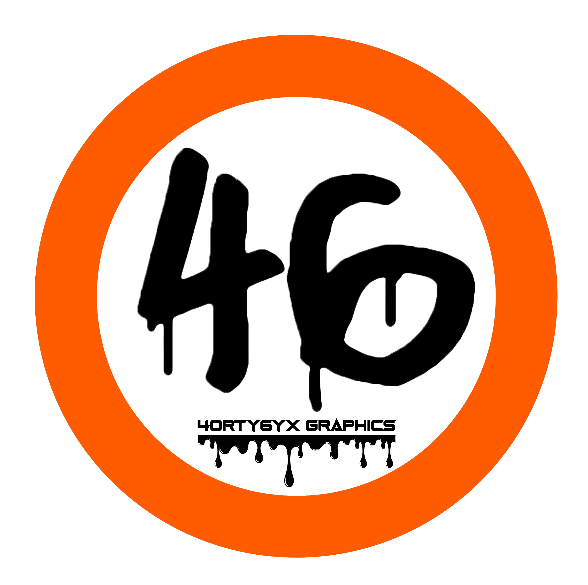

 
</a>
<h1 align="center"><b>4ORTY6YX OFFICIAL</b>
 
 
</a>
  

  
 
 

 
</a>

 &nbsp;
 &nbsp;
 &nbsp;
 &nbsp;
 &nbsp;
 &nbsp;
 &nbsp;
 &nbsp;
 &nbsp;
 &nbsp;
 &nbsp;

call me alunya

<h4>Graphics designer</h4>
<h4>Fullstack developer</h4>
<h4>funny in life, lowkey comedian</h4>
<h4>whatsapp me here❄️❄️:https://wa.link/0l9zkk</h4>

 
 
</a>
